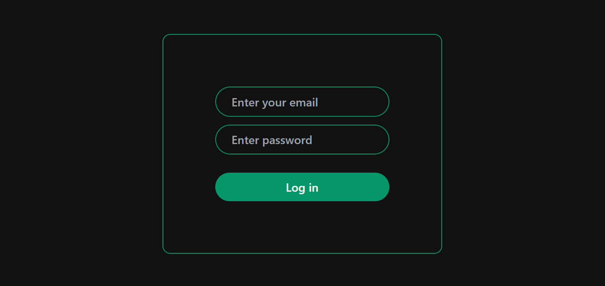
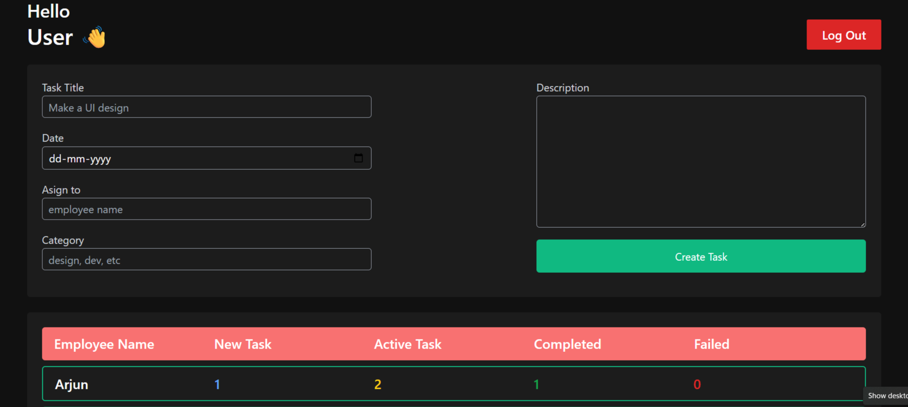
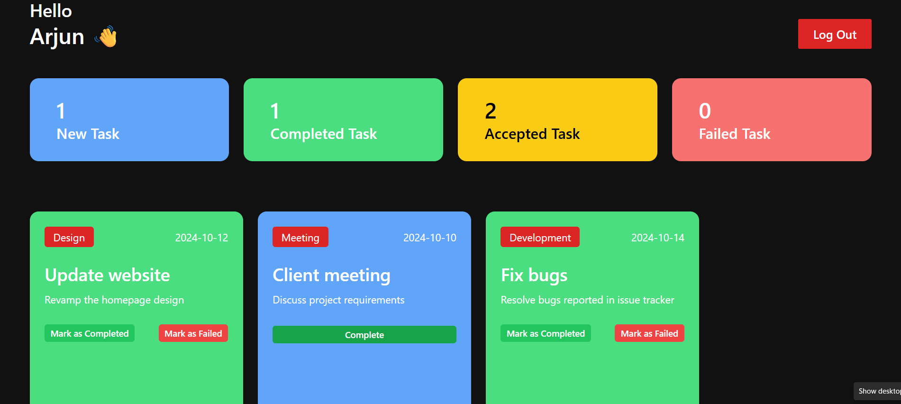
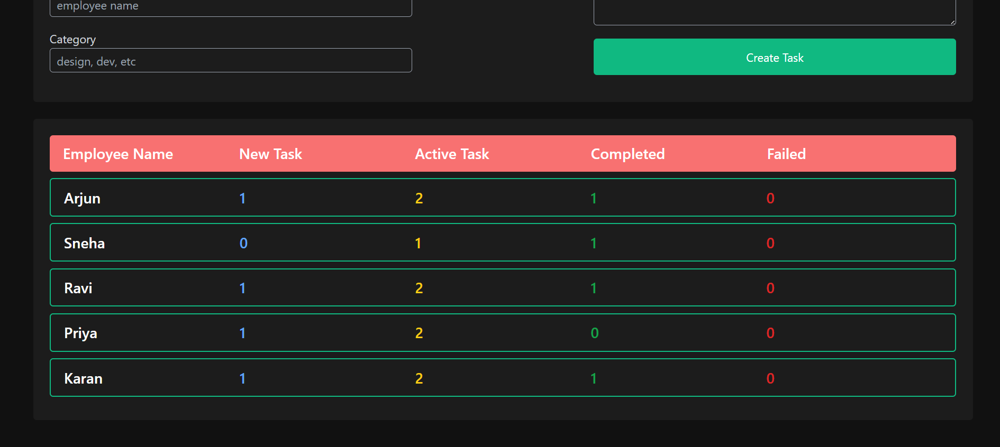

# 👨‍💼 Employee Management System


## 📖 Overview
The **Employee Management System** is a professional and responsive frontend application built with React.js. It facilitates streamlined task assignment and tracking between administrators and employees. Administrators can seamlessly assign tasks to specific employees and monitor overall progress, while employees can log in to view, accept, and update the status of their assigned tasks in real-time.

## 🚀 Live Demo
**View the application live:** [https://ems-rky.vercel.app/](https://ems-rky.vercel.app/)

## 📸 Screenshots

<p align="center">
  
  
</p>

<p align="center">
  
  
</p>

## ✨ Features
- **Admin Authentication**: Secure login for administrators.
- **Employee Authentication**: Independent portal for individual employees.
- **Task Assignment**: Admins can assign detailed tasks to specific employees.
- **Accept Task**: Employees can move tasks from "New" to "Active".
- **Mark as Completed**: Employees can finalize tasks and close them out.
- **Mark as Failed**: Employees can report issues by failing a task.
- **Task Counters**: Real-time statistical counters for tracking task status.
- **Persistent LocalStorage**: All data is saved directly in the browser's local storage for a fully persistent session.
- **Responsive Dashboard**: Beautiful, mobile-friendly UI using modern design principles.
- **React Context API State Management**: Unified, globally accessible state management for dynamic UI updates without refreshing.

## 🛠 Tech Stack
- **React.js** - Frontend UI library
- **Vite** - Next-generation frontend tooling
- **Context API** - Global state management
- **JavaScript (ES6+)** - Core application logic
- **HTML5 & CSS3** - Semantic structure and custom styling
- **LocalStorage** - Browser-based data persistence

## 🔑 Demo Credentials

To test the application, use the following credentials:

| Role | Email | Password |
|---|---|---|
| **Admin** | `admin@me.com` | `123` |
| **Employee** | `e@e.com` | `123` |

*(Note: You can also use any other pre-populated employee email found in the system.)*

## 💻 Installation

Follow these steps to run the project locally on your machine.

```bash
# 1. Clone the repository
git clone https://github.com/rkyadvji/Employee-management-system.git

# 2. Navigate to the project directory
cd Employee-management-system

# 3. Install dependencies
npm install

# 4. Start the development server
npm run dev
```

## 📁 Project Structure

```text
src/
├── assets/         # Static assets like images and icons
├── components/     # Reusable UI components
│   ├── Auth/       # Login and authentication views
│   ├── Dashboard/  # Main views for Admin and Employee
│   ├── TaskList/   # Individual task cards and list rendering
│   └── other/      # Headers, forms, and statistics components
├── context/        # React Context API providers (AuthProvider.jsx)
├── Utils/          # Helper functions and LocalStorage initializers
├── App.jsx         # Root component and routing logic
└── main.jsx        # Application entry point
```

## ⚙️ How It Works

1. **Initialization:** On first load, the app hydrates `localStorage` with default demo data (if empty) and populates the global `AuthContext`.
2. **Authentication:** The `App.jsx` handles login verification against the unified context data.
3. **Task Assignment:** Admins use the dashboard form to create tasks. The state is updated in context and saved to storage.
4. **Task Lifecycle:** Employees receive tasks in their portal. Clicking "Accept", "Complete", or "Fail" updates the specific task flag and recalculates the statistics counter, providing instant UI feedback.
5. **Persistence:** Every single state change is instantly mirrored back into the browser's `localStorage` so data survives page refreshes.

## 🚀 Future Improvements

While this is currently a frontend-only application, future iterations are planned to include:
- **Node.js Backend**: Moving away from `localStorage` to a fully functioning server.
- **Express.js**: Building robust REST APIs.
- **MongoDB**: Implementing a scalable NoSQL database.
- **JWT Authentication**: Secure, token-based authentication.
- **Role-based Authorization**: Stricter backend validation for Admin vs Employee actions.
- **Real-time Updates**: WebSockets for instant task notifications.

## ✍️ Author

Developed and maintained by **[rkyadvji](https://github.com/rkyadvji)**.